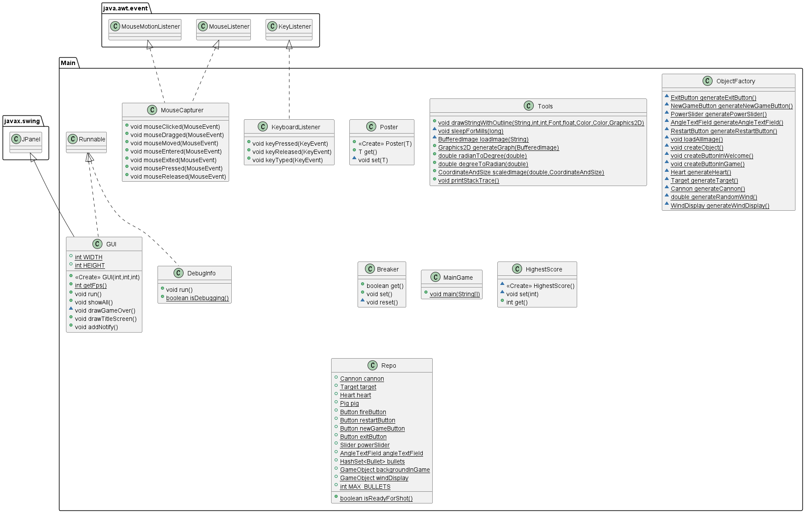
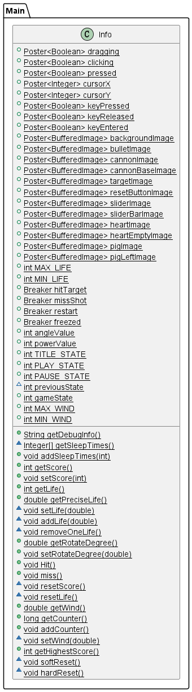
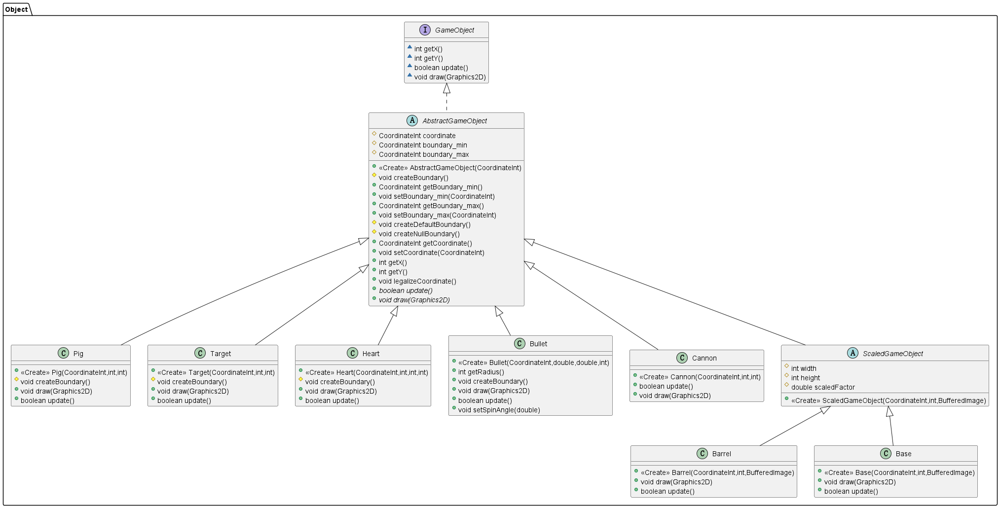
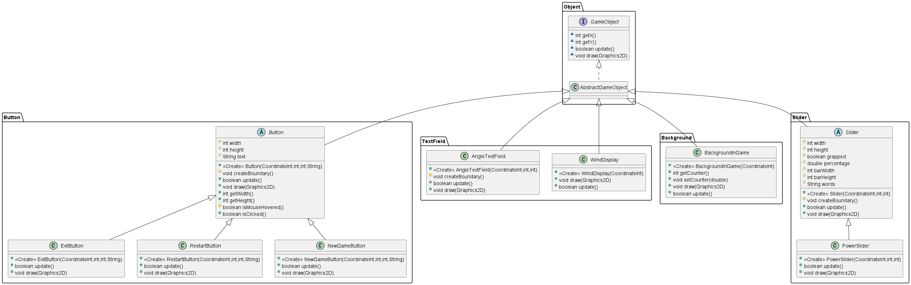

# Naughty Piggy

# Installation
Run the `main(String[])` method in the MainGame class and enjoy the game.

# Background

# Instruction

# Code Structure
## Libraries
* `java.awt`: user interface drawing
* `javax.swing`: user interface panel
* `java.io`: image loading, score storing

## Classes Overview

 
Main Package without Info

 
Info Class

 
Game Objects

 
Buttons, Texts and Backgrounds

## Main Loop
The game runs at 60 frames per second. During each interface between frames, the main loop calls `draw()` methods in each game object and then calls `update()` methods and finally runs `checkAll()` method to renew game status.

## Game Status
At the title page, the main thread creates buttons and texts. During the transition from the title page to gaming, the main thread destories old objects and creates new ones for gaming. `drawObject(GameObject, Graphic2D)` and `updateObject(GameObject)` methods automatically check if an object is null without throwing exceptions.

## Game Objects
All game objects including cannon, pig and buttons should implement GameObject interface. For convenience, game objects also inherit AbstractGameObject that provides 4 methods named `getX()`, `getY()`, `update()` and `draw()`. With polymorphism, the main class uses game objects without knowing their exact class types.

## Information Callboard
### `Poster<T>`
* The types of the data posted by the main loop are all 1Poster<T>1 where all classes can get data but only the ones in the Main package have the access to change.
* For example, images read from files, mouse and keyboard status.
### `Breaker`
* Another type of data named Breaker enables the access to set status to true for all classes but to false only for classes in the Main package.
* For example, every object can trigger an alarm of game restarting, but only the main loop has the right to cancel it. A metaphor for it is a fire alarm in a building where everyone can trigger an alarm, but only the administrator can handle and cancel it.
