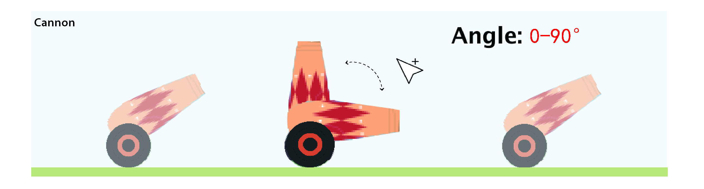

# Naughty Piggy

# Background
Long long ago, in Hidden valley farm Los Altos, there was a piglet named **Naughty**. One day he stole a forbidden magical apple and got a pair of wings after eating it. You as the protector of the magical apple need to use your apple cannon to stop Naughty flying away…

# Installation
Run the `main(String[])` method in the `MainGame` class and enjoy the game.

# Instruction

* Users reach a welcome page that attracts their attention and get information to make sure users know what they are expected to do during the game.

* Gaming page involves the objects and elements virtually.
* You can click the restart button in the upper left corner to reset the game if necessary.

* Move your mouse to adjust the shooting angle (0-90°).
* Each round, you get random locations of the apple cannon and target piggy.

* Slide the power bar to adjust the shooting power(0 to 100) of the apple cannon；
* Be aware of the random wind direction and amount of wind resistance each round;
* Click around the apple cannon to shoot;

* The piggy falls down when you have shot an apple bullet at it, and randomly appears on the next turn;
* You only have 5 lives, once you hit the piggy 4 times  you can retrieve a quarter of life back;
* Game over if there is no life left;
* Highest score record will be saved in the system. Try to beat it!

# Code Structure
## Libraries
* `java.awt`: user interface drawing
* `javax.swing`: user interface panel
* `java.io`: image loading, score storing

## Classes Overview
### Main Package

### Game Objects

### Buttons, Texts and Backgrounds

## Main Loop
The game runs at 60 frames per second. During each interface between frames, the main loop calls `draw()` methods in each game object and then calls `update()` methods and finally runs `checkAll()` method to renew game status.

## Game Status
At the title page, the main thread creates buttons and texts. During the transition from the title page to gaming, the main thread destories old objects and creates new ones for gaming. `drawObject(GameObject, Graphic2D)` and `updateObject(GameObject)` methods automatically check if an object is null without throwing exceptions.

## Game Objects
All game objects including cannon, pig and buttons should implement GameObject interface. For convenience, game objects also inherit AbstractGameObject that provides 4 methods named `getX()`, `getY()`, `update()` and `draw()`. With polymorphism, the main class uses game objects without knowing their exact class types.

## Information Callboard
### `Poster<T>`
* The types of the data posted by the main loop are all `Poster<T>` where all classes can get data but only the ones in the Main package have the access to change.
* For example, images read from files, mouse and keyboard status.
### `Breaker`
* Another type of data named Breaker enables the access to set status to true for all classes but to false only for classes in the Main package.
* For example, every object can trigger an alarm of game restarting, but only the main loop has the right to cancel it. A metaphor for it is a fire alarm in a building where everyone can trigger an alarm, but only the administrator can handle and cancel it.
